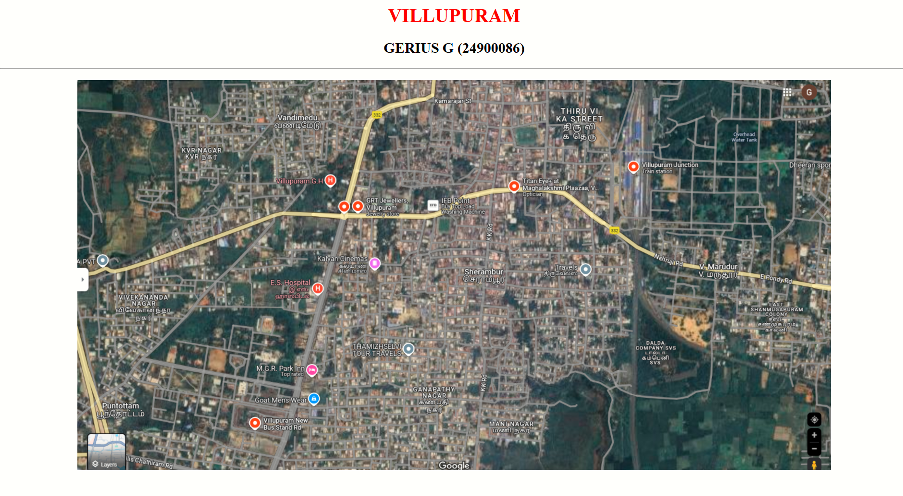
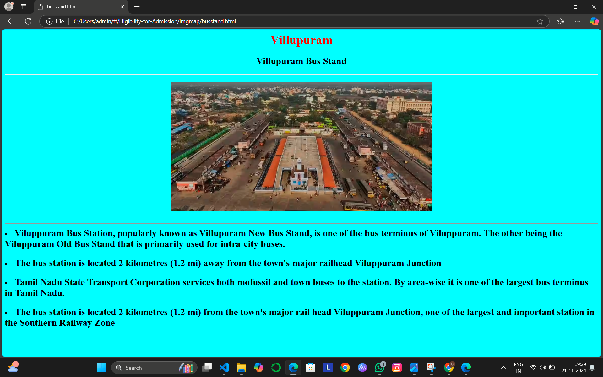
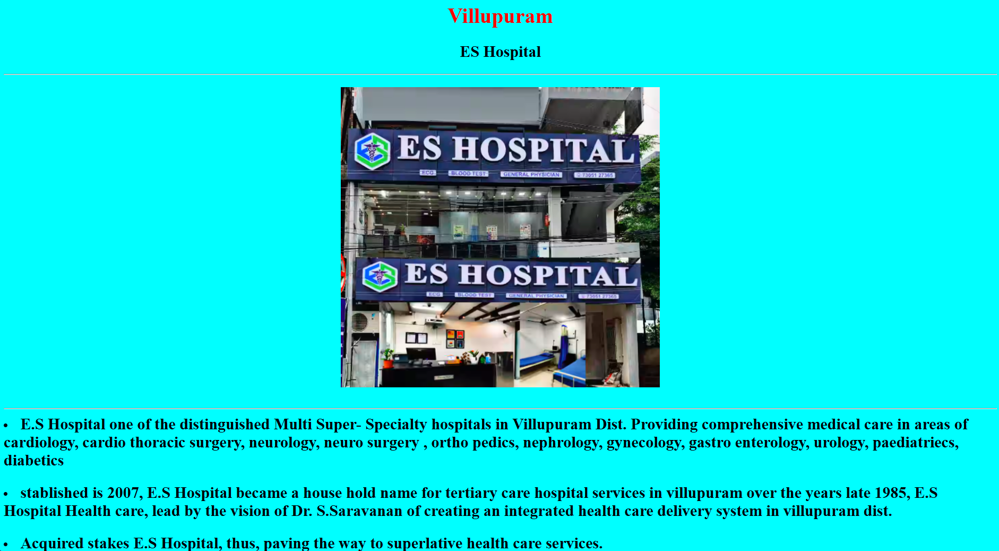
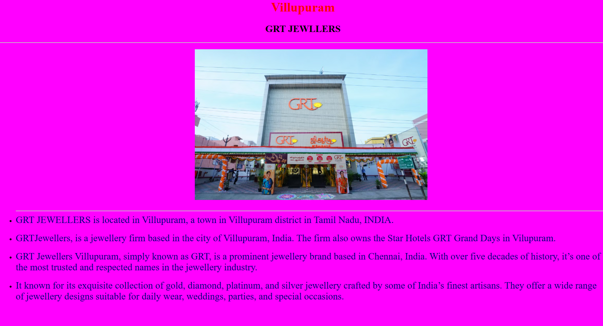
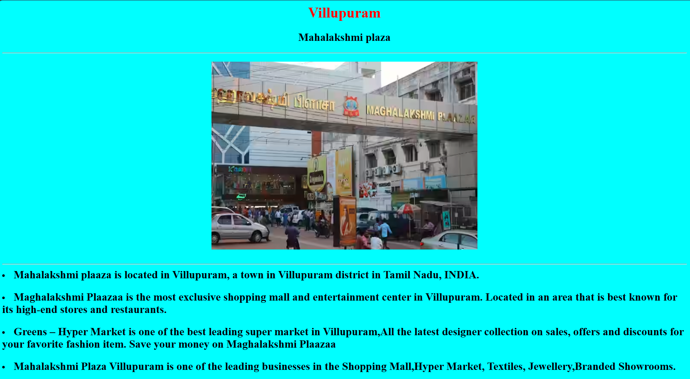
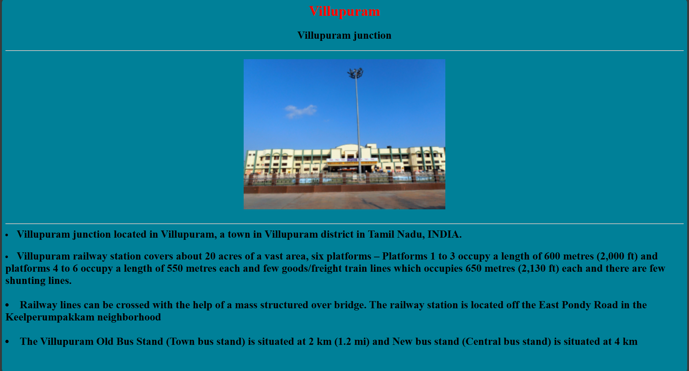

# Ex04 Places Around Me
## Date: 22/11/2024

## AIM
To develop a website to display details about the places around my house.

## DESIGN STEPS

### STEP 1
Create a Django admin interface.

### STEP 2
Download your city map from Google.

### STEP 3
Using ```<map>``` tag name the map.

### STEP 4
Create clickable regions in the image using ```<area>``` tag.

### STEP 5
Write HTML programs for all the regions identified.

### STEP 6
Execute the programs and publish them.

## CODE
```
imagemap.html

<html>
    <body>
        <h1 align="center ">
            <font color="red">
                VILLUPURAM
            </font>
        </h1>
        <h2 align="center">
            GERIUS G (24900086)
        </h2>
        <hr>
        <h3>
            <center>
                

<map name="image-map">
    <area target="" alt="ES hospital" title="ES hospital" href="es.html" coords="309,318,421,376" shape="rect">
    <area target="" alt="villupuram bus stand" title="villupuram bus stand" href="busstand.html" coords="276,553,392,590" shape="rect">
    <area target="" alt="grt jewellers" title="grt jewellers" href="jewellers.html" coords="449,189,552,223" shape="rect">
    <area target="" alt="mahalakshmi plaza" title="mahalakshmi plaza" href="plaza.html" coords="708,157,868,198" shape="rect">
    <area target="" alt="villupuram junction" title="villupuram junction" href="junction.html" coords="902,127,1045,162" shape="rect">
</map>
            </center>
        </h3>
</html>

bus stand.html

<html>
<body bgcolor="cyan">
    <h1 align="center">
        <font color="red">
          Villupuram
        </font>
    </h1>
    <h2 align="center">
       Villupuram Bus Stand 
    </h2>
    <hr>
    <h3>
        <center> 
        
        </center>
        <br>
        <hr>
        <li>
            <font size="5">
                Viluppuram Bus Station, popularly known as Villupuram New Bus Stand, is one of the bus terminus of Viluppuram.
                The other being the Viluppuram Old Bus Stand that is primarily used for intra-city buses.
            </font>
        </li>
        <br>
        <li>
            <font size="5">
                The bus station is located 2 kilometres (1.2 mi) away from the town's major railhead Viluppuram Junction

            </font>
        </li>
        <br>
        <li>
            <font size="5">
                Tamil Nadu State Transport Corporation services both mofussil and town buses to the station. By area-wise it is one of the largest bus terminus in Tamil Nadu.
            </font>
        </li>
        <br>
        <li>
            <font size="5">
                The bus station is located 2 kilometres (1.2 mi) from the town's major rail head Viluppuram Junction, one of the largest and important station in the Southern Railway Zone
            </font>
        </li>
    </h3>
</body>
</html>

ES hospital.html

<html>
<body bgcolor="aqua">
    <h1 align="center">
        <font color="red">
          Villupuram
        </font>
    </h1>
    <h2 align="center">
       ES Hospital
    </h2>
    <hr>
    <h3>
        <center> 
        
        </center>
        <br>
        <hr>
        <li>
            <font size="5">
                E.S Hospital one of the distinguished Multi Super- Specialty hospitals in Villupuram Dist. Providing comprehensive medical care in areas of cardiology, cardio thoracic surgery, neurology, neuro surgery , ortho pedics, nephrology, gynecology, gastro enterology, urology, paediatriecs, diabetics
            </font>
        </li>
        <br>
        <li>
            <font size="5">
                stablished is 2007, E.S Hospital became a house hold name for tertiary care hospital services in villupuram over the years late 1985, E.S Hospital Health care, lead by the vision of Dr. S.Saravanan of creating an integrated health care delivery system in villupuram dist.
            </font>
        </li>
        <br>
        <li>
            <font size="5">
                Acquired stakes E.S Hospital, thus, paving the way to superlative health care services.
            </font>
        </li>
    </h3>
</body>

</html>

jewellers.html

<html>
<body bgcolor="white">
    <h1 align="center">
        <font color="red">
          Villupuram
        </font>
    </h1>
    <h2 align="center">
      GRT JEWLLERS
    </h2>
    <hr>
    <ul>
        <center> 
        
        </center>
        <br>
        <hr>
        <li>
            <font size="5" color="navy">
                GRT JEWELLERS is located in Villupuram, a town in Villupuram district in Tamil Nadu, INDIA. 
            </font>
        </li>
        <br>
        <li>
            <font size="5"color="navy">
                GRTJewellers, is a jewellery firm based in the city of Villupuram, India. The firm also owns the Star Hotels GRT Grand Days in Vilupuram.

            </font>
        </li>
        <br>
        <li>
            <font size="5"color="navy">
                GRT Jewellers Villupuram, simply known as GRT, is a prominent jewellery brand based in Chennai, India.
                 With over five decades of history, it’s one of the most trusted and respected names in the jewellery industry.
            </font>
        </li>
        <br>
        <li>
            <font size="5"color="navy">
                It known for its exquisite collection of gold, diamond, platinum, and silver jewellery crafted by some of India’s finest artisans. 
                They offer a wide range of jewellery designs suitable for daily wear, weddings, parties, and special occasions.
            </font>
        </li>
        </ul>
</body>

</html>

plaza.html

<html>
<body bgcolor="cyan">
    <h1 align="center">
        <font color="red">
          Villupuram
        </font>
    </h1>
    <h2 align="center">
        Mahalakshmi plaza
    </h2>
    <hr>
    <h3>
        <center> 
        
        </center>
        <br>
        <hr>
        <li>
            <font size="5">
                Mahalakshmi plaaza is located in Villupuram, a town in Villupuram district in Tamil Nadu, INDIA. 
            </font>
        </li>
        <br>
        <li>
            <font size="5">
                Maghalakshmi Plaazaa is the most exclusive shopping mall and entertainment center in Villupuram. Located in an area that is best known for its high-end stores and restaurants.

            </font>
        </li>
        <br>
        <li>
            <font size="5">
                Greens – Hyper Market is one of the best leading super market in Villupuram,All the latest designer collection on sales, offers and discounts for your favorite fashion item. Save your money on Maghalakshmi Plaazaa
            </font>
        </li>
        <br>
        <li>
            <font size="5">
                Mahalakshmi Plaza Villupuram is one of the leading businesses in the Shopping Mall,Hyper Market, Textiles, Jewellery,Branded Showrooms.
            </font>
        </li>
    </h3>
</body>

</html>

junction.html

<html>
<body bgcolor="teal">
    <h1 align="center">
        <font color="red">
          Villupuram
        </font>
    </h1>
    <h2 align="center">
        Villupuram junction
    </h2>
    <hr>
    <h3>
        <center> 
        
        </center>
        <br>
        <hr>
        <li>
            <font size="5">
               Villupuram junction located in Villupuram, a town in Villupuram district in Tamil Nadu, INDIA. 
            </font>
        </li>
        <br>
        <li>
            <font size="5">
                Villupuram railway station covers about 20 acres of a vast area, six platforms – Platforms 1 to 3 occupy a length of 600 metres (2,000 ft) and platforms 4 to 6 occupy a length of 550 metres each and few goods/freight train lines which occupies 650 metres (2,130 ft) each and there are few shunting lines.
        </li>
        <br>
        <li>
            <font size="5">
                Railway lines can be crossed with the help of a mass structured over bridge. The railway station is located off the East Pondy Road in the Keelperumpakkam neighborhood
            </font>
        </li>
        <br>
        <li>
            <font size="5">
                The Villupuram Old Bus Stand (Town bus stand) is situated at 2 km (1.2 mi) and New bus stand (Central bus stand) is situated at 4 km 
            </font>
        </li>
    </h3>
</body>

```

## OUTPUT








## RESULT
The program for implementing image maps using HTML is executed successfully.
